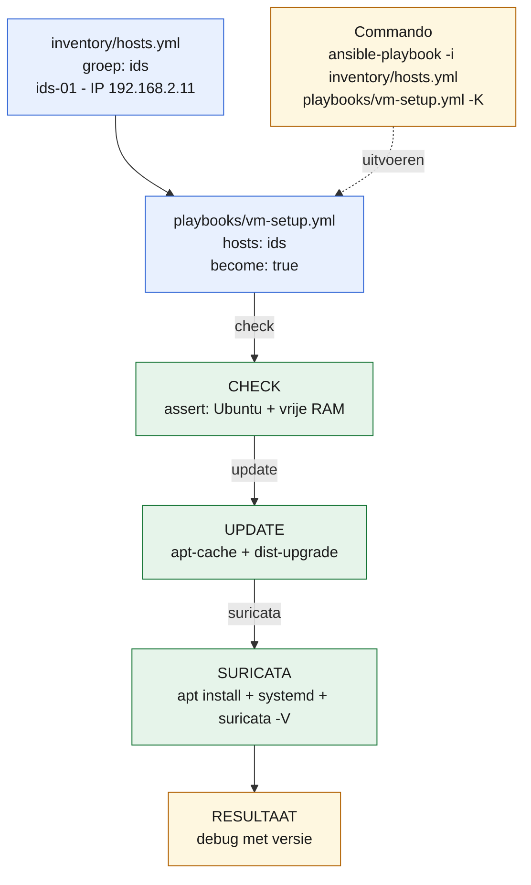

# Ansible-flow voor IDS-01

```mermaid
flowchart TD
    A["inventory/hosts.yml<br/>groep: ids<br/>ids-01 - IP 192.168.2.11"]
    B["playbooks/vm-setup.yml<br/>hosts: ids<br/>become: true"]
    C["CHECK<br/>assert: Ubuntu + vrije RAM"]
    D["UPDATE<br/>apt-cache + dist-upgrade"]
    E["SURICATA<br/>apt install + systemd + suricata -V"]
    F["RESULTAAT<br/>debug met versie"]
    G["Commando<br/>ansible-playbook -i inventory/hosts.yml<br/>playbooks/vm-setup.yml -K"]

    A --> B
    B -->|check| C
    C -->|update| D
    D -->|suricata| E
    E --> F
    G -. uitvoeren .-> B

    classDef source fill:#e8f0fe,stroke:#3367d6,color:#1a1a1a;
    classDef step fill:#e6f4ea,stroke:#137333,color:#1a1a1a;
    classDef result fill:#fef7e0,stroke:#b06000,color:#1a1a1a;

    class A,B source;
    class C,D,E step;
    class F,G result;
```
